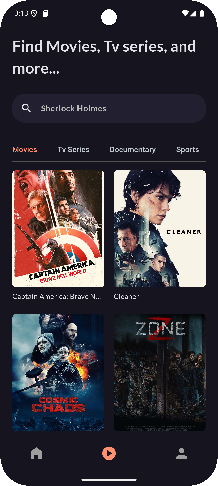
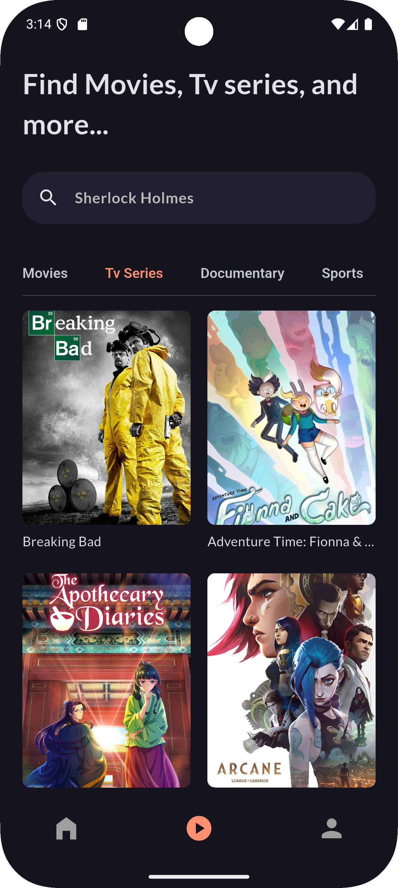

# 🎬 Flutter Movie App

A beautifully designed movie streaming app built with Flutter, leveraging TMDB API for movie data and VidSrc API for streaming. 🚀
The app is designed to offer a visually appealing and intuitive interface, ensuring smooth navigation and interaction. Whether you want to explore trending movies, search for your favorite films, or watch trailers before deciding, this app has you covered.

# Preview

<table>
  <tr>
    <td align="center"><b>Home Screen</b></td>
    <td align="center"><b>Movie Details Screen</b></td>
  </tr>
  <tr>
    <td></td>
    <td></td>
  </tr>
</table>

<table>
  <tr>
    <td align="center"><b>Movies Tab</b></td>
    <td align="center"><b>Series Tab</b></td>
  </tr>
  <tr>
    <td></td>
    <td></td>
  </tr>
</table>

## ✨ Features
- 🔍 **Discover Movies** – Browse trending, top-rated, and upcoming movies
- 🎥 **Stream Videos** – Watch movies seamlessly via VidSrc API
- 🔖 **Save Favorites** – Bookmark movies for later viewing
- 🌓 **Dark & Light Mode** – Enjoy a sleek UI with theme support
- ⚡ **Smooth & Fast** – Optimized for performance and great user experience

## 🛠️ Tech Stack
- **Flutter & Dart** – Cross-platform development
- **TMDB API** – Fetch movie details, ratings, and posters
- **VidSrc API** – Stream movies effortlessly

## 🚀 Getting Started

### Prerequisites
- Flutter installed ([Installation Guide](https://flutter.dev/docs/get-started/install))
- An API key from [TMDB](https://www.themoviedb.org/)

### Api keys
Create a .env file in the root directory and add your TMDB api key as follows:
```
API_KEY=your_tmdb_api_key
```
### ⚠️ Key Considerations
- API Key Security: Using a `.env` file in mobile applications is not recommended as API keys can be extracted from the app.
- Best Practices:
  - Use backend proxy servers to securely fetch data and avoid exposing API keys in the frontend. 
  - If you must store API keys in the app, consider obfuscation techniques, but this is not foolproof. 
  - Use Firebase Functions or your own backend as an intermediary to handle API requests securely.